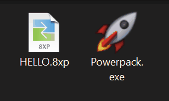
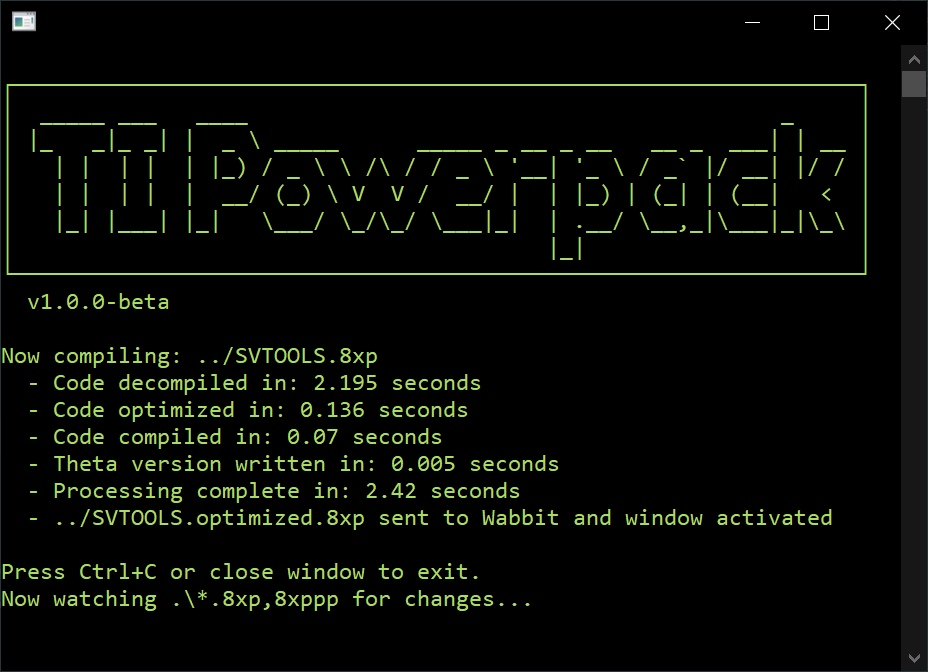

#  TI Basic Powerpack   Create TI Basic programs with powerful new features

Version 1.0.0-beta

## [Website & User Guide](https://ti-powerpack.github.io)

Powerpack assists with coding TI‑Basic 8XP programs for TI‑84+ calculators — compiling and compressing them to provide new features, trim file size, and make coding a more enjoyable experience.

1. Write TI Basic code with new features provided by Powerpack:

   

2. Run Powerpack to translate the code into standard TI Basic and compress its size:

   

   
   

[Learn more on the website](https://ti-powerpack.github.io/)
