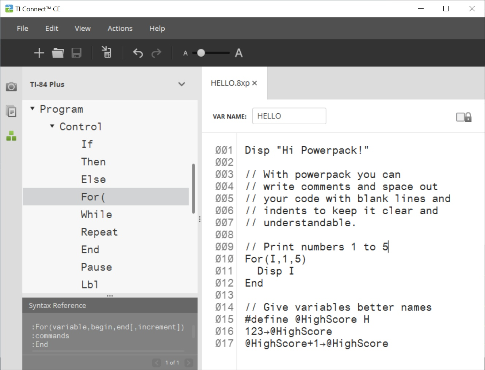
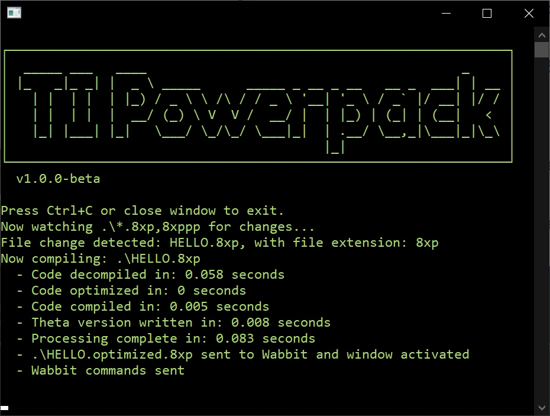

# What is TI Basic Powerpack?

Powerpack is a Windows program that assists with writing TI-Basic 8XP programs for Texas TI-83 or TI-84 Plus calculators — compiling and compressing them to provide new features, trim file size, and make coding a more enjoyable experience.

You will want to get familiar with the basics of TI Basic before diving into Powerpack as it's designed for more advanced users.

Then simply write your TI Basic code in TI Connect CE (or your favourite code editor), run Powerpack.exe, and have the resulting file ready for loading onto your calculator or emulator:

## Making TI Basic more enjoyable

The main goal is to make TI Basic programming more enjoyable by:

* Letting you use unlimited comments (without increasing file size)
* Letting you add blank line returns and indent your code (without increasing file size)
* Allow you to give variables and "Goto" labels more descriptive names - more than just 1 or 2 characters
* Automatically transferring your program to WabbitEmu and running it, every time you save the file — allowing you to test and iterate faster
* Store a copy of your code in text format, for better tracking of history with git
* Keeping your program file size as small as possible

## How it works

Powerpack:

1. Decompiles your 8XP code, either when you run it on a specific file, or by watching for changes in a specific folder

2. Saves a copy of the original source code in plain text format

3. Converts any Powerpack-specific syntax into standard TI-Basic syntax which your calculator understands

4. Optimizes the program by removing unnecessary characters, spaces and line returns

5. Saves a copy of this optimized program in text format

6. Recompiles into 8XP format, ready for loading onto your calculator, WabbitEmu, or other emulator